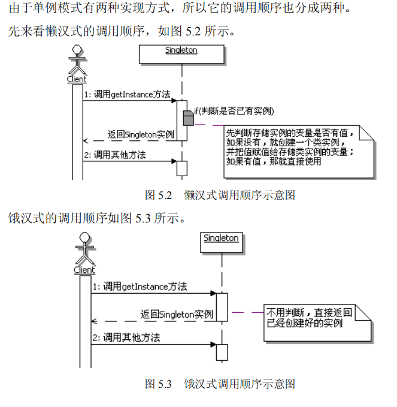
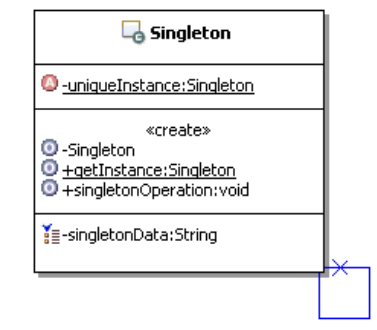

# 单例模式

场景：考虑这样一个应用，读取配置文件的内容。
很多应用项目，都有与应用相关的配置文件，这些配置文件很多是由项目开发人员
自定义的，在里面定义一些应用需要的参数数据。当然在实际的项目中，这种配置文件
多采用 xml 格式，也有采用 properties 格式的，毕竟使用 Java 来读取 properties 格式的配
置文件比较简单。
现在要读取配置文件的内容，该如何实现呢？

## 不用设计模式

有些朋友会想，要读取配置文件的内容，这也不是个困难的事情，直接读取文件的
内容，然后把文件内容存放在相应的数据对象里面就可以了。真的这么简单吗？先实现
看看吧。
为了示例简单，假设系统采用的是 properties 格式的配置文件

- 具体代码实现在no-pattern/srcmain/java/文件夹下
---
## 有什么问题？

上面的实现很简单，很容易的就实现要求的功能。仔细想想，有没有什么问题呢？
看看客户端使用这个类的地方，是通过 new 一个 AppConfig 的实例来得到一个操作
配置文件内容的对象。如果在系统运行中，有很多地方都需要使用配置文件的内容，也
就是说很多地方都需要创建 AppConfig 对象的实例。

换句话说，在系统运行期间，系统中会存在很多个 AppConfig 的实例对象，这有什
么问题吗？

当然有问题了，试想一下，每一个 AppConfig 实例对象里面都封装着配置文件的内
容，系统中有多个 AppConfig 实例对象，也就是说系统中会同时存在多份配置文件的内
容，这样会严重浪费内存资源。如果配置文件内容较少，问题还小一点，如果配置文件
内容本来就多的话，对于系统资源的浪费问题就大了。事实上，对于 AppConfig 这种类，
在运行期间，只需要一个实例对象就是够了。

---

## 怎么解决？

- 使用单例模式来解决问题
 
单例模式的定义 : 保证一个类仅有一个实例，并提供一个访问它的全局访问点。
   
   
   
   
---

仔细分析上面的问题，现在一个类能够被创建多个实例，问题的根源在于类的构造
方法是公开的，也就是可以让类的外部来通过构造方法创建多个实例。换句话说，只要
类的构造方法能让类的外部访问，就没有办法去控制外部来创建这个类的实例个数。
要想控制一个类只被创建一个实例，那么首要的问题就是要把创建实例的权限收回
来，让类自身来负责自己类实例的创建工作，然后由这个类来提供外部可以访问这个类
实例的方法，这就是单例模式的实现方式。

Singleton：负责创建 Singleton 类自己的唯一实例，并提供一个 getInstance 的方法，
让外部来访问这个类的唯一实例。

- 具体代码实现在apply-pattern/srcmain/java/文件夹下

## 目的

控制实例数目。

## 什么时候用单例模式

建议在以下情况中选用单例模式。

- 当需要控制一个类的实例只能有一个，而且客户只能从一个全局访问点访问它时，
  可以选用单例模式，这些功能恰好是单例模式要解决的问题。
  