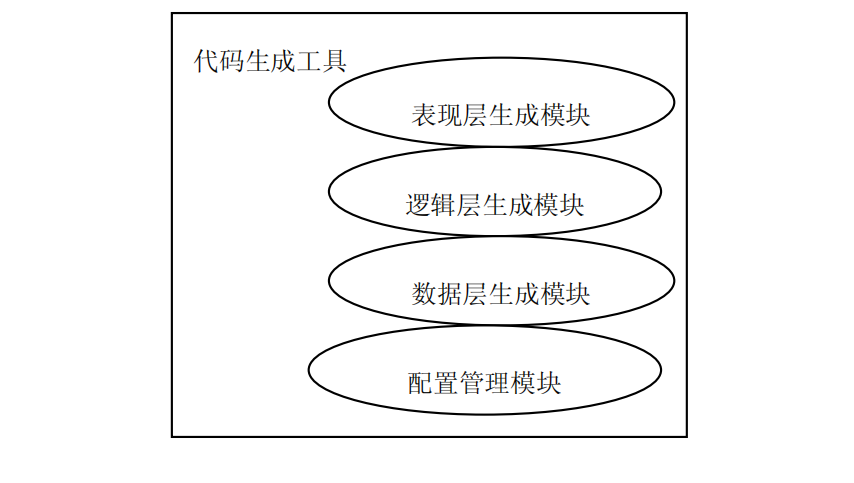
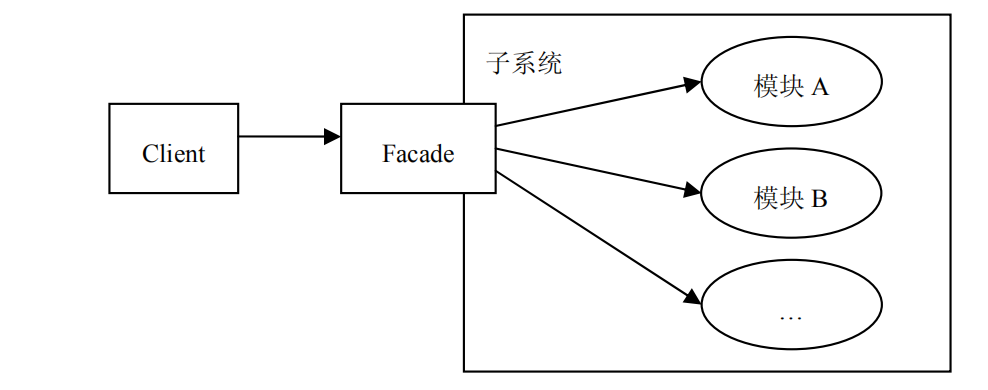
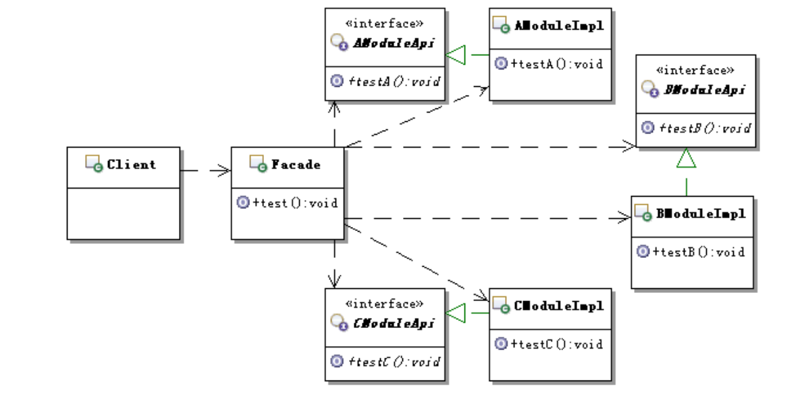

# 外观模式

场景：

考虑这样一个实际的应用：代码生成。

很多公司都有这样的应用工具，能根据配置生成代码。一般这种工具都是公司内部
使用，较为专有的工具，生成的多是按照公司的开发结构来实现的常见的基础功能，比
如增删改查。这样每次在开发实际应用的时候，就可以以很快的速度把基本的增删改查
实现出来，然后把主要的精力都放在业务功能的实现上。
当然这里不可能去实现一个这样的代码生成工具，那需要整本书的内容，这里仅用
它来说明外观模式。
假设使用代码生成出来的每个模块都具有基本的三层架构，分为表现层、逻辑层和
数据层，那么代码生成工具里面就应该有相应的代码生成处理模块。
另外，代码生成工具自身还需要一个配置管理的模块，通过配置来告诉代码生成工
具，每个模块究竟需要生成哪些层的代码。比如，通过配置来描述，是只需要生成表现
层代码呢，还是三层都生成。具体的模块示意如图 所示。

那么现在客户端需要使用这个代码生成工具来生成需要的基础代码，该如何实现
呢？

## 不用设计模式
- 具体代码实现在 no-pattern 文件夹下
---
## 有什么问题？

仔细查看代码的实现，会发现其中有一个问题：那就是客户端为了使用生成代码的
功能，需要与生成代码子系统内部的多个模块交互。
这对于客户端而言，是个麻烦，使得客户端不能简单地使用生成代码的功能。而且，
如果其中的某个模块发生了变化，还可能会引起客户端也要随着变化。
那么如何实现，才能让子系统外部的客户端在使用子系统的时候，既能简单地使用
这些子系统内部的模块功能，而又不用客户端去与子系统内部的多个模块交互呢？

---

## 怎么解决？

- 使用外观模式来解决问题
 
 的定义 :
 
 为子系统中的一组接口提供一个一致的界面，Test.Facade 模式定义了一个高层接口，
 这个接口使得这一子系统更加容易使用。
 

 
---

## 用设计模式

类图如下：

- 具体代码实现在 apply-pattern文件夹下

## 目的

外观模式的目的不是给子系统添加新的功能接口，而是为了让外部减少与子系统内
多个模块的交互，松散耦合，从而让外部能够更简单地使用子系统。

这点要特别注意，因为外观是当作子系统对外的接口出现的，虽然也可以在这里定
义一些子系统没有的功能，但不建议这么做。外观应该是包装已有的功能，它主要负责
组合已有功能来实现客户需要，而不是添加新的实现。

## 什么时候用简单工厂模式

建议在如下情况时选用外观模式

- 如果你希望为一个复杂的子系统提供一个简单接口的时候，可以考虑使用外观
  模式。使用外观对象来实现大部分客户需要的功能，从而简化客户的使用。

- 如果想要让客户程序和抽象类的实现部分松散耦合，可以考虑使用外观模式，
  使用外观对象来将这个子系统与它的客户分离开来，从而提高子系统的独立性
  和可移植性。
  
- 如果构建多层结构的系统，可以考虑使用外观模式，使用外观对象作为每层的
  入口，这样可以简化层间调用，也可以松散层次之间的依赖关系。