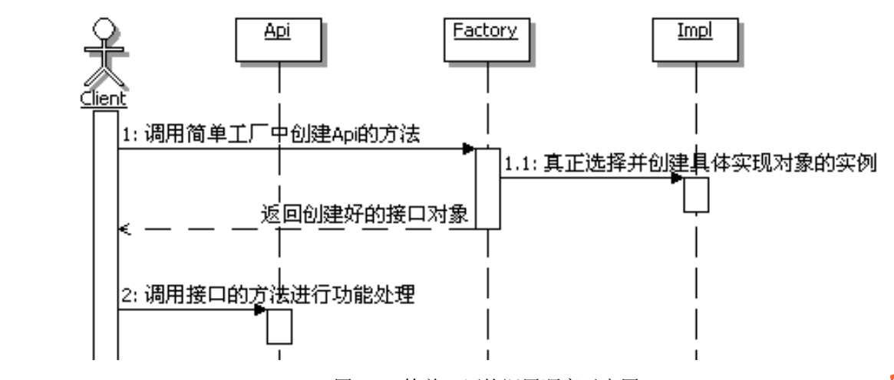

# 简单工厂模式

场景：回忆一下，以前是如何使用接口的呢，假设有一个接口叫 Api，然后有一个实现类
   Impl 实现了它，在客户端怎么用这个接口呢？

## 不用设计模式

通常都是在客户端创建一个 Impl 的实例，把它赋值给一个 Api 接口类型的变量，然
后客户端就可以通过这个变量来操作接口的功能了

- 具体代码实现在no-pattern文件夹下
---
## 有什么问题？

在客户端调用的时候，客户端不但知道了接口，同时还知道了具体的实现
就是 Impl。接口的思想是“封装隔离”，而实现类 Impl 应该是被接口 Api 封装并同客户
端隔离开的，也就是说，客户端根本就不应该知道具体的实现类是 Impl。
---

## 怎么解决？

- 使用简单工厂来解决问题
 
 简单工厂的定义 :提供一个创建对象实例的功能，而无须关心其具体实现。被创建实例的类型可
   以是接口、抽象类，也可以是具体的类。
   
   
   
---

## 用设计模式

干脆在模块内部新建一个类，在这个类里面来创建接口，然后把创建好的接
口返回给客户端，这样，外部应用就只需要根据这个类来获取相应的接口对象，然后就
可以操作接口定义的方法了。把这样的对象称为简单工厂，就叫它 Factory 吧。
这样一来，客户端就可以通过 Factory 来获取需要的接口对象，然后调用接口的方法
来实现需要的功能，而且客户端也不用再关心具体的实现了。

类图如下：

- 具体代码实现在pattern文件夹下

## 目的

简单工厂的目的在于为客户端来选择
相应的实现，从而使得客户端和实现之间解耦。这样一来，具体实现发生了变化，就不
用变动客户端了，这个变化会被简单工厂吸收和屏蔽掉。

## 什么时候用简单工厂模式

建议在以下情况中选用简单工厂。

- 如果想要完全封装隔离具体实现，让外部只能通过接口来操作封装体，那么可
  以选用简单工厂，让客户端通过工厂来获取相应的接口，而无须关心具体的实
  现。
  
- 如果想要把对外创建对象的职责集中管理和控制，可以选用简单工厂，一个简
  单工厂可以创建很多的、不相关的对象，可以把对外创建对象的职责集中到一
  个简单工厂来，从而实现集中管理和控制。