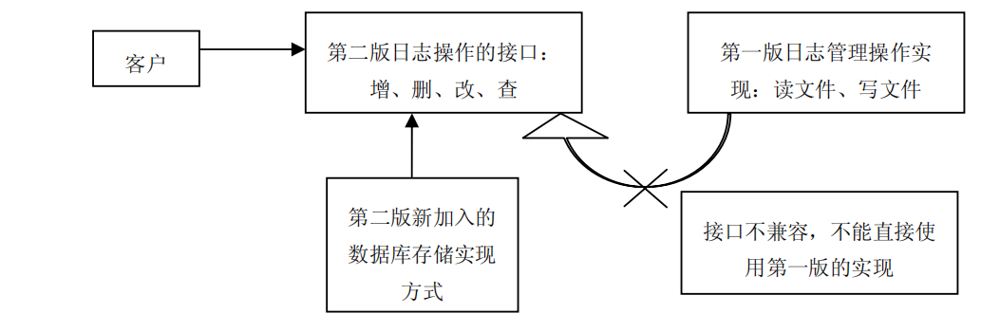
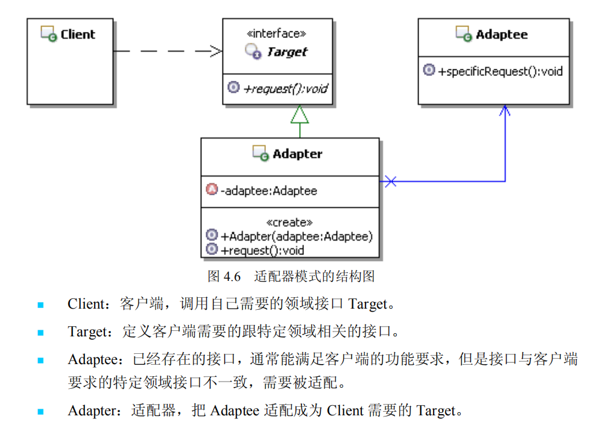
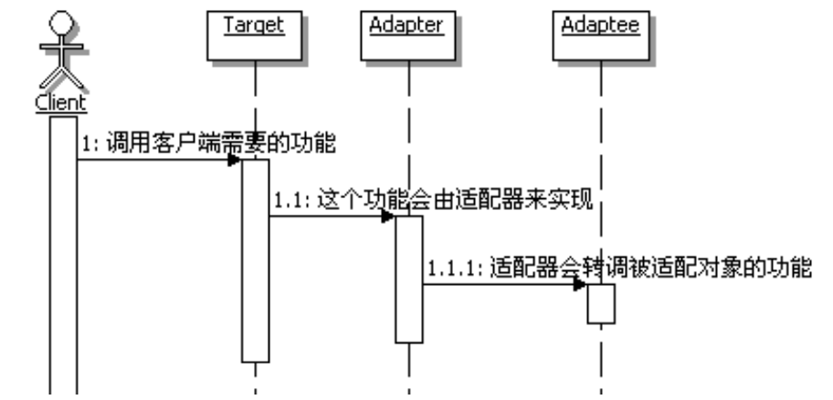

# 适配器模式

场景：一个记录日志的应用,由于用户对日志记录的要求很高，使得开发人员不能简
     单地采用一些已有的日志工具或日志框架来满足用户的要求，而需要按照用户的要求重
     新开发新的日志管理系统。当然这里不可能完全按照实际系统那样去完整实现，只是抽
     取跟适配器模式相关的部分来讲述。
    
   - 日志第一版
   
     于是在第一版的时候，用户要求日志以文件的形式记录。开发人员遵照用户的要求，对
     日志文件的存取实现见代码no-pattern/src/main/java/logMannagerOne文件夹下。
     
   - 日志第二版
   
     户使用日志管理第一版一段时间后，开始考虑升级系统，决定要采用数据库来管
     理日志。很快，按照数据库的日志管理也实现出来了，并定义了日志管理的操作接口，
     主要是针对日志的增删改查方法，示例代码在no-pattern/src/main/java/logMannagerTwo文件夹下。

问题来了：

客户提出了新的要求，能不能让日志管理第二版实现同时支持数据库存储和文件存
储两种方式？
---
## 有什么问题？

有朋友可能会想，这有什么困难的呢，两种实现方式不是都已经实现了的吗，合并
起来不就可以了？

问题就在于，现在的业务是使用的第二版的接口，直接使用第二版新加入的实现是
没有问题的，第二版新加入了保存日志到数据库中；但是对于已有的实现方式，也就是
在第一版中采用的文件存储的方式，它的**操作接口和第二版不一样**，这就导致现在的客
户端无法以同样的方式来直接使用第一版的实现 如下图

---

## 怎么解决？

- 使用配器模式来解决问题
 

配器模式的定义
:    将一个类的接口转换成客户希望的另外一个接口。适配器模式使得原本由于接口
            不兼容而不能一起工作的那些类可以一起工作。
   
 
   
---

## 用设计模式

类图如下：

- 具体代码实现在apply-pattern/src/main/java/logMannagerAdapter文件夹下

## 目的

适配器模式的本质是：转换匹配，复用功能。

 

## 什么时候用适配器模式

建议在以下情况中选用适配器模式。

- 如果你想要使用一个已经存在的类，但是它的接口不符合你的需求，这种情况
  可以使用适配器模式，来把已有的实现转换成你需要的接口。
  
- 如果你想创建一个可以复用的类，这个类可能和一些不兼容的类一起工作，这
  种情况可以使用适配器模式，到时候需要什么就适配什么。

- 如果你想使用一些已经存在的子类，但是不可能对每一个子类都进行适配，这
  种情况可以选用对象适配器，直接适配这些子类的父类就可以了。